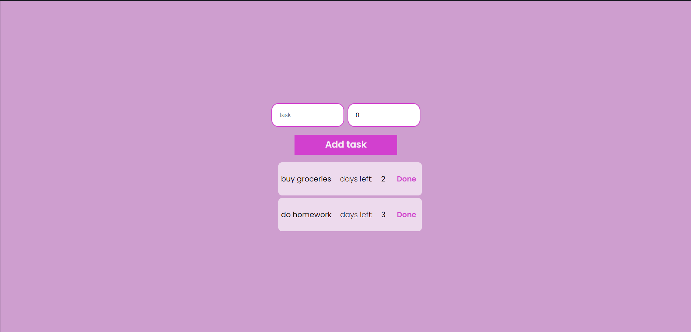

[![Contributors][contributors-shield]][contributors-url]
[![Forks][forks-shield]][forks-url]
[![Stargazers][stars-shield]][stars-url]
[![Issues][issues-shield]][issues-url]
[![MIT License][license-shield]][license-url]
[![LinkedIn][linkedin-shield]][linkedin-url]

<br />
<div align="center">
  <h3 align="center">To-do List</h3>

  <p align="center">
    <br />
    <a href="https://github.com/AlikiKap/Typescript-to-do-list.git"><strong>Explore the docs »</strong></a>
    <br />
    <br />
    <a href="https://alikikap.github.io/Typescript-to-do-list/">View Demo</a>
    ·
    <a href="https://github.com/AlikiKap/Typescript-to-do-list/issues">Report Bug</a>
    ·
    <a href="https://github.com/AlikiKap/Typescript-to-do-list/issues">Request Feature</a>
  </p>
</div>



## Table of contents
1. [About The Project](#about-the-project)
    * [Built With](#built-with)
2. [Installation](#installation)
3. [Usage](#usage)
4. [License](#license)
5. [Contact](#contact)
## About The Project

This To-Do List App is a simple yet powerful tool designed to help users manage their tasks efficiently. It provides an intuitive user interface for creating and organizing tasks, making it easier to stay organized and productive. Whether you're a student, a professional, or anyone with a busy schedule, this app can assist you in keeping track of your to-do list with ease.
Demo: https://alikikap.github.io/Typescript-to-do-list/
### Built With
* [![React][React.js]][React-url]
<p align="right">(<a href="#readme-top">back to top</a>)</p>

## Installation

Follow these steps to get the project up and running on your local machine:

Clone the repository:

```bash
  git clone https://github.com/AlikiKap/Typescript-to-do-list.git
```
Navigate to the project directory:
```bash
  cd Typescript-to-do-list
```
Install the dependencies:
```bash
  npm install
```
## Usage

Once you have installed the dependencies, you can start the development server:

```bash
  npm run start
```
This will start the application in development mode, and you can access it in your web browser at http://localhost:3000.
<br/>
<!-- LICENSE -->
## License

Distributed under the MIT License. See `LICENSE.txt` for more information.

<p align="right">(<a href="#readme-top">back to top</a>)</p>


## Contact

Aliki Kapasakalidi - [@AlikiKap](https://www.linkedin.com/in/aliki-kapasakalidi-921891203/) - aliki02.kapasakalidi@gmail.com

Project Link: [https://github.com/AlikiKap/Typescript-to-do-list.git](https://github.com/AlikiKap/Typescript-to-do-list.git)

<p align="right">(<a href="#readme-top">back to top</a>)</p>


[contributors-shield]: https://img.shields.io/github/contributors/AlikiKap/Typescript-to-do-list.svg?style=for-the-badge
[contributors-url]: https://github.com/AlikiKap/Typescript-to-do-list/graphs/contributors
[forks-shield]: https://img.shields.io/github/forks/AlikiKap/Typescript-to-do-list.svg?style=for-the-badge
[forks-url]: https://github.com/AlikiKap/Typescript-to-do-list/network/members
[stars-shield]: https://img.shields.io/github/stars/AlikiKap/Typescript-to-do-list.svg?style=for-the-badge
[stars-url]: https://github.com/AlikiKap/Typescript-to-do-list/stargazers
[issues-shield]: https://img.shields.io/github/issues/AlikiKap/Typescript-to-do-list.svg?style=for-the-badge
[issues-url]: https://github.com/AlikiKap/Typescript-to-do-list/issues
[license-shield]: https://img.shields.io/github/license/othneildrew/Best-README-Template.svg?style=for-the-badge
[license-url]: https://github.com/AlikiKap/Typescript-to-do-list/blob/main/LICENSE
[linkedin-shield]: https://img.shields.io/badge/-LinkedIn-black.svg?style=for-the-badge&logo=linkedin&colorB=555
[linkedin-url]: https://www.linkedin.com/in/aliki-kapasakalidi-921891203/
[product-screenshot]: images/screenshot.png
[React.js]: https://img.shields.io/badge/React-20232A?style=for-the-badge&logo=react&logoColor=61DAFB
[React-url]: https://reactjs.org/


